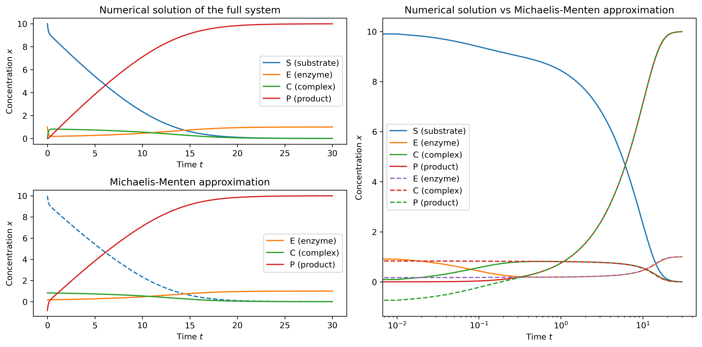
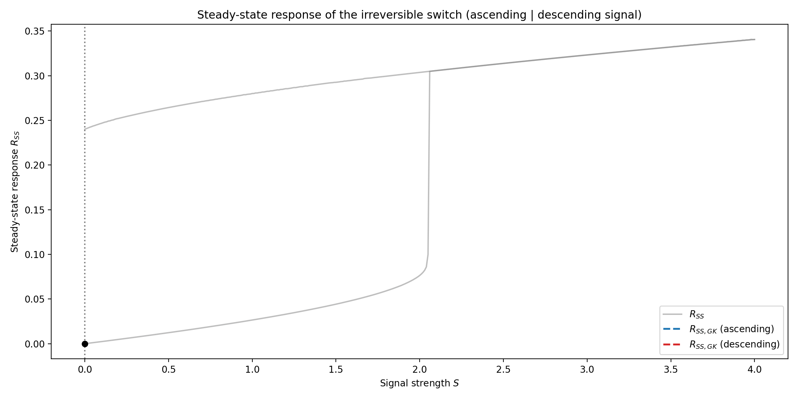

# Mathematical Modeling (ETHZ course)
The repository contains projects completed as part of the **Mathematical Modeling for Bioengineering and Systems Biology** course at ETH Zurich. This course offers an introduction to modeling biological systems and solving linear systems of ODEs.

**Further details about the projects can be found in their respective project directories.**

## Projects overview

### <a href="reaction_mechanisms">1. &nbsp; Biochemical reaction kinetics and mechanisms</a>
This project explores various different reaction orders with their numerical and analytical solutions, as well as basic biochemical reaction mechanisms and their numerical solution, assuming mass-action kinetics for all reactions. Each rate equation scheme is translated into a system of ordinary differential equations (ODEs) and the numerical solution for each species is plotted over time.

***Figure 1.2:** Six different reaction mechanisms were solved over time. Rate equation schemes and the underlying ODEs are provided in the corresponding notebook.*

### <a href="modeling_approximations">2. &nbsp; Enzyme kinetics and regulatory network modeling approximations</a>
This project explores modeling enzyme kinetics and regulatory networks using mass-action kinetics, as well as the Michaelis-Menten approximation for simulating enzyme kinetics and Goldbeter-Koshland (GK) kinetics for modeling regulatory networks.

***Figure 2.1:** A fully modeled enzymatic reaction is compared to the approximation by Michaelis-Menten kinetics. The plot on the right-hand side uses a logarithmic scale for time to highlight where the Michaelis-Menten approximation (dashed lines) fails.*

***Figure 2.3:** The response to a signal with an added positive feedback loop is compared to the approximation by Goldbeter-Koshland kinetics. The plots on the right demonstrate how the GK approximation behaves when scaling the model parameters.*

### <a href="signaling_response">3. &nbsp; Steady-state behavior, response type and irreversible switch</a>
This project explores the steady-state behaviour of the previously studied networks, discusses how networks respond to a signal and introduces an irreversible switch that exhibits hysteretic steady-state behavior. We use this example to highlight the limitations of the Goldbeter-Koshland (GK) approximation.

***Figure 3.2:** Steady-state response of an irreversible switch, with the blue line showing the response to an increasing signal and the red line showing the response to a subsequently decreasing signal (both using the GK-approximation).*

### <a href="phase_plane_analysis">4. &nbsp; Phase plane analysis and hysteretic oscillators</a>
This project demonstrates a phase plane analysis to evaluate the stability of steady states and thereby the dynamic behaviour upon perturbations from the steady state. The previously discussed irreversible (one-way) switch was extended to become either an activator-inhibitor or a substrate-depletion oscillator.

***Figure 4.1:** Phase portrait of a system with two stable and one unstable steady states. Animated trajectories highlight the system's behavior over time given different initial conditions.*

***Figure 4.2:** Phase portrait of a substrate-depletion (left) and an activator-inhibitor (right) oscillator. The simulated trajectories highlight the limit-cylce behavior of both networks.*

## Dependencies, installation and usage
Each of the directories in this repository contains a `README.md` file, detailing any dependencies, how to run the files, their usage and additional information about the projects.

## Contributing
If you want to contribute to this project, found any bugs or have new feature ideas, please open an issue!

## License
This project is licensed under the **GNU General Public License v3.0**, allowing you to freely use, modify, and distribute the code. Any derived works must also be licensed under GPL-3.0, promoting open-source collaboration and transparency. Please review the license terms before using or contributing to this project.
