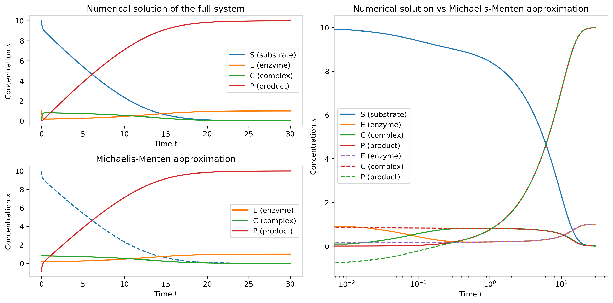
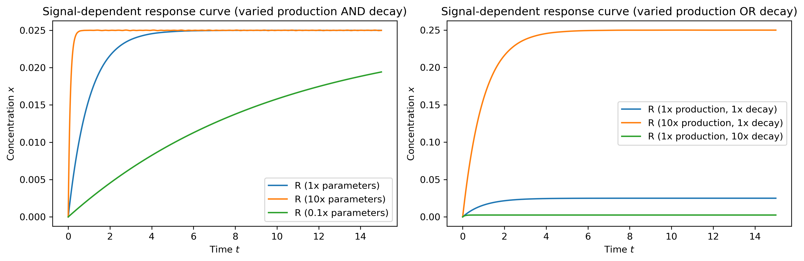
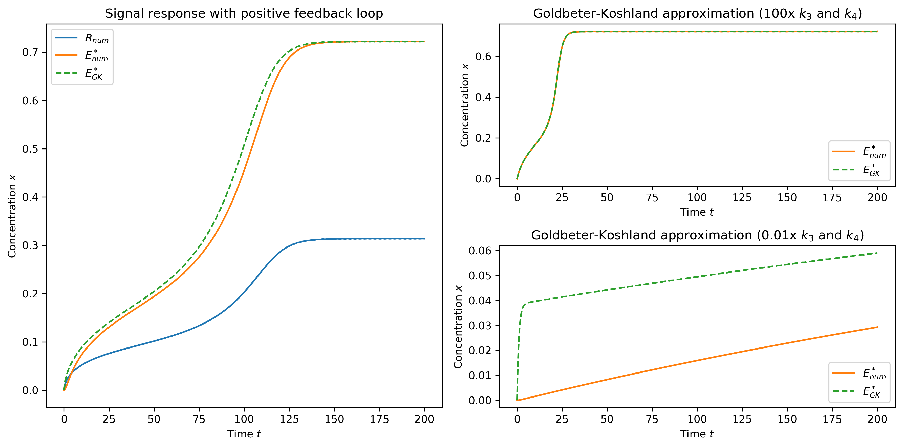

# 2. &nbsp; Enzyme kinetics and regulatory network modeling approximations
This project explores modeling enzyme kinetics and regulatory networks using mass-action kinetics, as well as the Michaelis-Menten approximation for simulating enzyme kinetics and Goldbeter-Koshland kinetics for modeling regulatory networks.

## File description
#### <a href="michaelis_menten.ipynb">`michaelis_menten.ipynb`</a>
The first Jupyter notebook simulates a basic enzymatic reaction and compares the result to the Michaelis-Menten approximation of the same system.

#### <a href="golbeter_koshland.ipynb">`golbeter_koshland.ipynb`</a>
The second notebook explores varying parameters of signal-dependent response curves. It also implements a signal response with positive feedback, comparing the numerical solution to the Goldbeter-Koshland approximation.

## Dependencies
This project requires the following Python libraries:
`numpy`
`scipy`
`matplotlib`

They can be installed using PIP:
```
pip install numpy scipy matplotlib
```

## Installation
Re-running the code in this notebook requires an installation of Python 3 and the libraries mentioned above. No external files are needed.

## Usage
The notebooks are annotated and self-explanatory. The implementation of the ODEs was realized using `solve_ivp` from `scipy.integrate`.

## Graphical output


***Figure 2.1:** A fully modeled enzymatic reaction is compared to the approximation by Michaelis-Menten kinetics. The plot on the right-hand side uses a logarithmic scale for time to highlight where the Michaelis-Menten approximation (dashed lines) fails.*



***Figure 2.2:** A signal-dependent response curve is plotted with varying production and decay rates, highlighting the difference between changing both parameters simultaneously or changing them independently.*



***Figure 2.3:** The response to a signal with an added positive feedback loop is compared to the approximation by Goldbeter-Koshland kinetics. The plots on the right demonstrate how the GK approximation behaves when scaling the model parameters.*

## Contributing
If you want to contribute to this project, found any bugs or have new feature ideas, please open an issue!

## License
This project is licensed under the **GNU General Public License v3.0**, allowing you to freely use, modify, and distribute the code. Any derived works must also be licensed under GPL-3.0, promoting open-source collaboration and transparency. Please review the license terms before using or contributing to this project.
