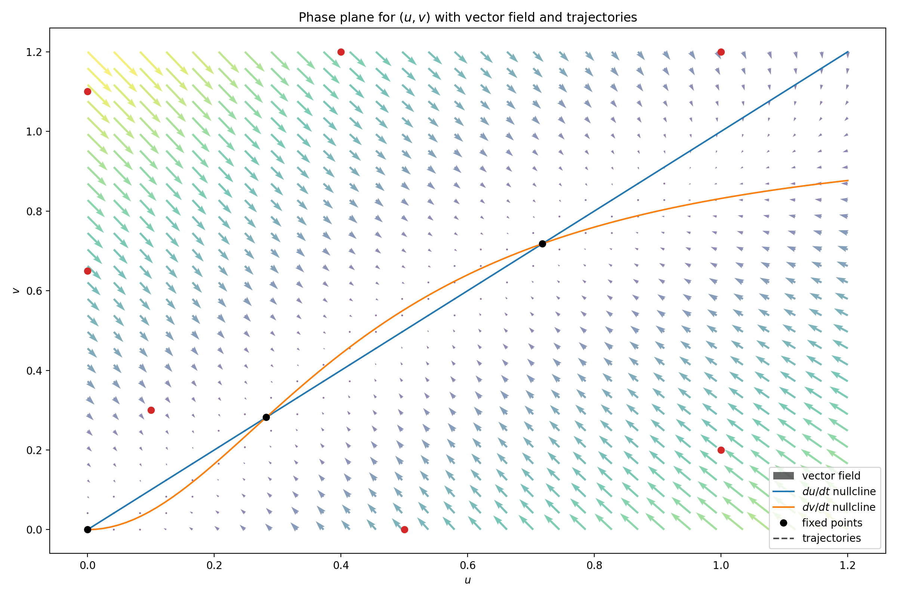

# 4. &nbsp; Phase plane analysis and hysteretic oscillators
This project demonstrates a phase plane analysis to evaluate the stability of steady states and thereby the dynamic behaviour upon perturbations from the steady state. The previously discussed irreversible (one-way) switch was extended to become either an activator-inhibitor or a substrate-depletion oscillator.

## File description
#### <a href="phase_plane_analysis.ipynb">`phase_plane_analysis.ipynb`</a>
The first Jupyter notebook is used to create a phase portrait of a simple dynamical system.

#### <a href="hysteretic_oscillators.ipynb">`hysteretic_oscillators.ipynb`</a>
The second notebook implements the two hysteretic oscillators.

#### <a href="phase_plane_animation.py">`phase_plane_animation.py`</a>
Script for animating a few trajectories in the phase portrait of the simple dynamical system. The animated plot can be shown directly or exported as a GIF by uncommenting the respective line at the end of the script.

#### <a href="oscillators_animation.py">`oscillators_animation.py`</a>
Script for animating some trajectories in the phase portraits of the two hysteretic oscillators. The animated plot can be shown directly or exported as a GIF by uncommenting the respective line at the end of the script.

## Dependencies
This project requires the following Python libraries:
`numpy`
`scipy`
`matplotlib`

They can be installed using PIP:
```
pip install numpy scipy matplotlib
```

## Installation
Re-running the code in this notebook requires an installation of Python 3 and the libraries mentioned above. No external files are needed.

## Usage
The notebooks are annotated and self-explanatory. The implementation of the ODEs was realized using `solve_ivp` from `scipy.integrate`.

## Graphical output


***Figure 4.1:** Phase portrait of a system with two stable and one unstable steady states. Animated trajectories highlight the system's behavior over time given different initial conditions.*


***Figure 4.2:** Phase portrait of a substrate-depletion (left) and an activator-inhibitor (right) oscillator. The simulated trajectories highlight the limit-cylce behavior of both networks.*

## Contributing
If you want to contribute to this project, found any bugs or have new feature ideas, please open an issue!

## License
This project is licensed under the **GNU General Public License v3.0**, allowing you to freely use, modify, and distribute the code. Any derived works must also be licensed under GPL-3.0, promoting open-source collaboration and transparency. Please review the license terms before using or contributing to this project.
