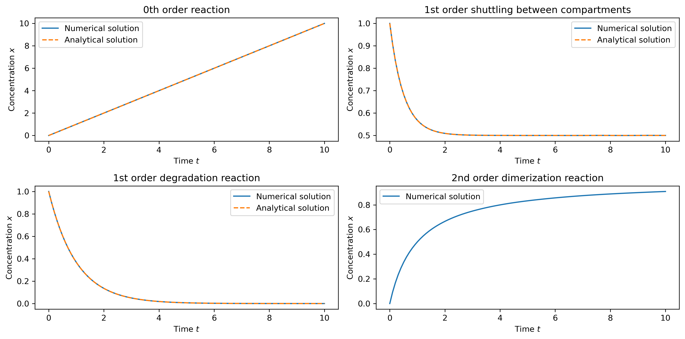
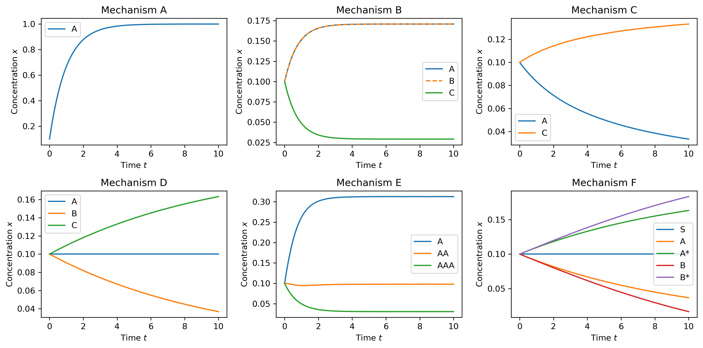

# 1. &nbsp; Biochemical reaction kinetics and mechanisms
This project explores various different reaction orders with their numerical and analytical solutions, as well as basic biochemical reaction mechanisms and their numerical solution, assuming mass-action kinetics for all reactions. Each rate equation scheme is translated into a system of ordinary differential equations (ODEs) and the numerical solution for each species is plotted over time.

## File description
#### <a href="reaction_kinetics.ipynb">`reaction_kinetics.ipynb`</a>
The first Jupyter notebook explores different orders of reaction kinetics and compares numerical with analytical solutions.

#### <a href="reaction_mechanisms.ipynb">`reaction_mechanisms.ipynb`</a>
The second notebook implements six different reaction mechanisms involving multiple species.

## Dependencies
This project requires the following Python libraries:
`numpy`
`scipy`
`matplotlib`

They can be installed using PIP:
```
pip install numpy scipy matplotlib
```

## Installation
Re-running the code in this notebook requires an installation of Python 3 and the libraries mentioned above. No external files are needed.

## Usage
The notebooks are annotated and self-explanatory. The implementation of the ODEs was realized using `solve_ivp` from `scipy.integrate`.

## Graphical output


***Figure 1.1:** Comparison of different reaction orders using analytical and numerical solutions.*



***Figure 1.2:** Six different reaction mechanisms were solved over time. Rate equation schemes and the underlying ODEs are provided in the corresponding notebook.*

## Contributing
If you want to contribute to this project, found any bugs or have new feature ideas, please open an issue!

## License
This project is licensed under the **GNU General Public License v3.0**, allowing you to freely use, modify, and distribute the code. Any derived works must also be licensed under GPL-3.0, promoting open-source collaboration and transparency. Please review the license terms before using or contributing to this project.
