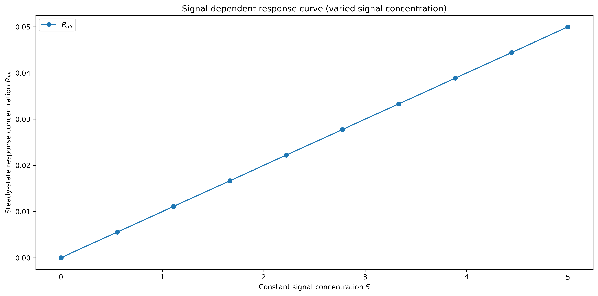
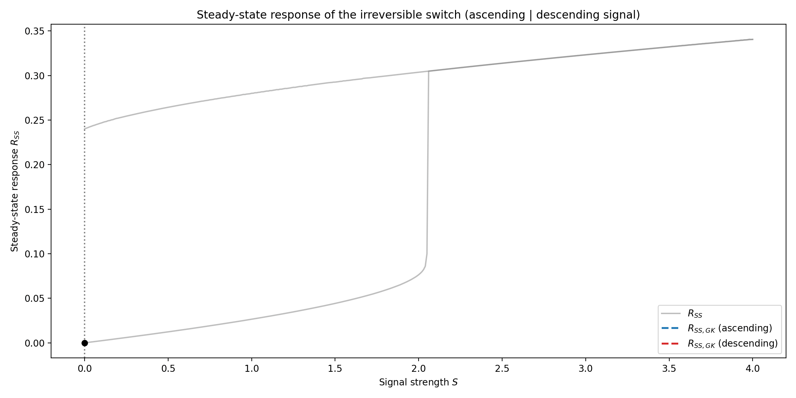

# 3. &nbsp; Steady-state behavior, response type and irreversible switch
This project explores the steady-state behaviour of the previously studied networks, discusses how networks respond to a signal and introduces an irreversible switch that exhibits hysteretic steady-state behavior. We use this example to highlight the limitations of the Goldbeter-Koshland (GK) approximation.

## File description
#### <a href="response_type.ipynb">`response_type.ipynb`</a>
The first Jupyter notebook simulates a simple reaction network and explains the effect of varying signal strengths.

#### <a href="irreversible_switch.ipynb">`irreversible_switch.ipynb`</a>
The second notebook explores varying parameters of signal-dependent response curves. It also implements a signal response with positive feedback, comparing the numerical solution to the Goldbeter-Koshland approximation.

#### <a href="irreversible_switch_steady_state.py">`irreversible_switch_steady_state.py`</a>
Script for animating the steady-state response of the irreversible switch. The animated plot can be shown directly or exported as a GIF by uncommenting the respective line at the end of the script.

#### <a href="irreversible_switch_full_response.py">`irreversible_switch_full_response.py`</a>
Script for animating the full response of the irreversible switch. The animated plot can be shown directly or exported as a GIF by uncommenting the respective line at the end of the script.

## Dependencies
This project requires the following Python libraries:
`numpy`
`scipy`
`matplotlib`

They can be installed using PIP:
```
pip install numpy scipy matplotlib
```

## Installation
Re-running the code in this notebook requires an installation of Python 3 and the libraries mentioned above. No external files are needed.

## Usage
The notebooks are annotated and self-explanatory. The implementation of the ODEs was realized using `solve_ivp` from `scipy.integrate`.

## Graphical output


***Figure 3.1:** Signal-dependent steady-state response curve of a simple reaction network, with the blue line showing the response to different signal strengths.*



***Figure 3.2:** Steady-state response of an irreversible switch, with the blue line showing the response to an increasing signal and the red line showing the response to a subsequently decreasing signal (both using the GK-approximation).*


***Figure 3.3:** Full response of the irreversible switch to changes in signal, using the same scheme for varying the signal as before and highlighting the limitations of the GK approximation.*

## Contributing
If you want to contribute to this project, found any bugs or have new feature ideas, please open an issue!

## License
This project is licensed under the **GNU General Public License v3.0**, allowing you to freely use, modify, and distribute the code. Any derived works must also be licensed under GPL-3.0, promoting open-source collaboration and transparency. Please review the license terms before using or contributing to this project.
